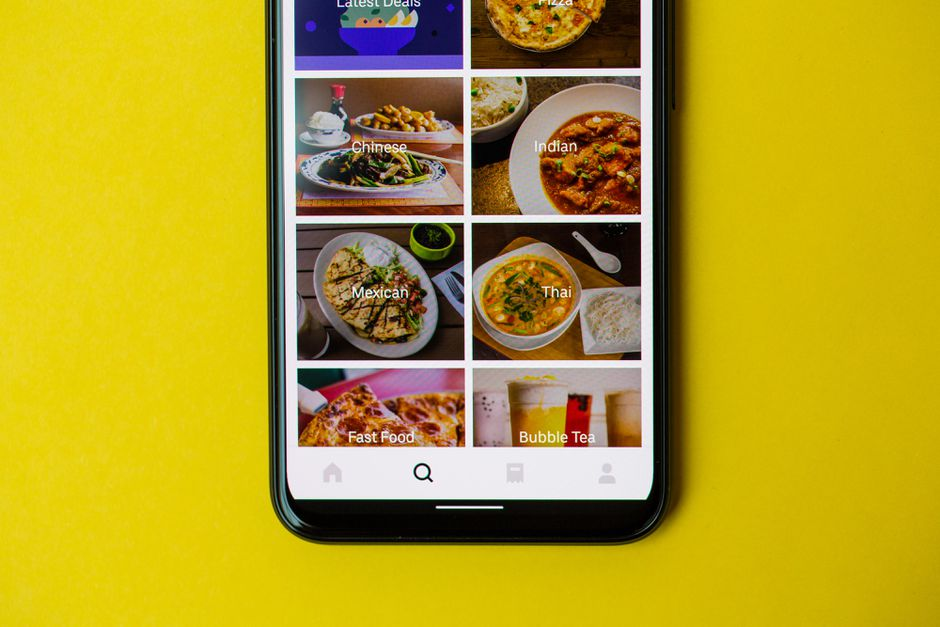
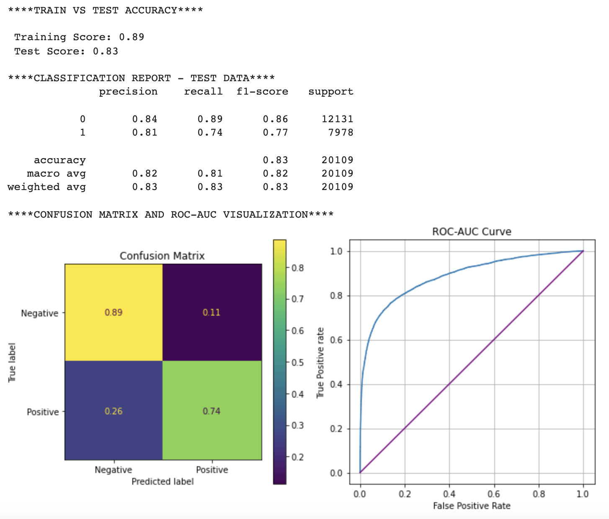
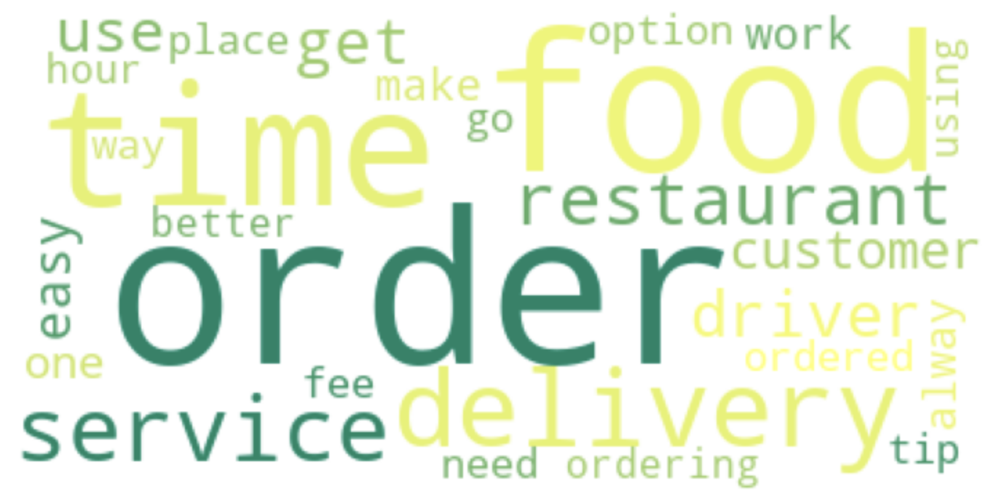
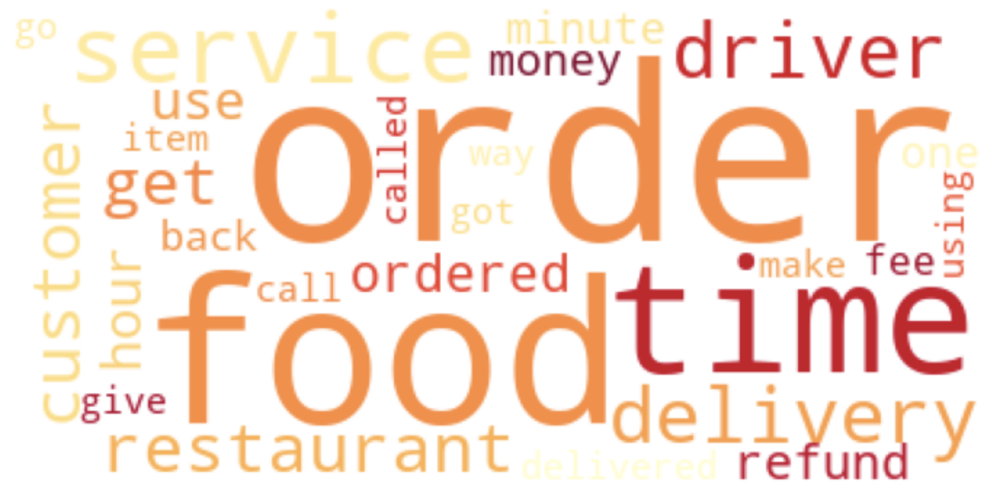
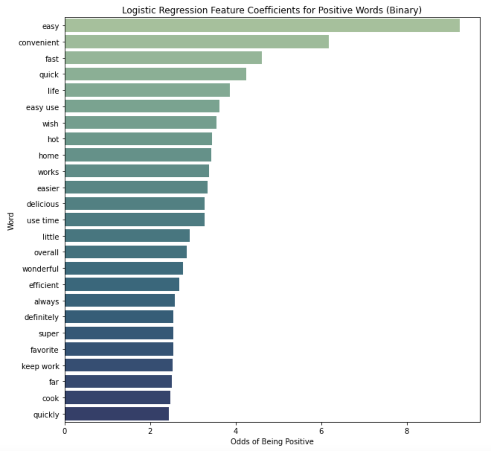
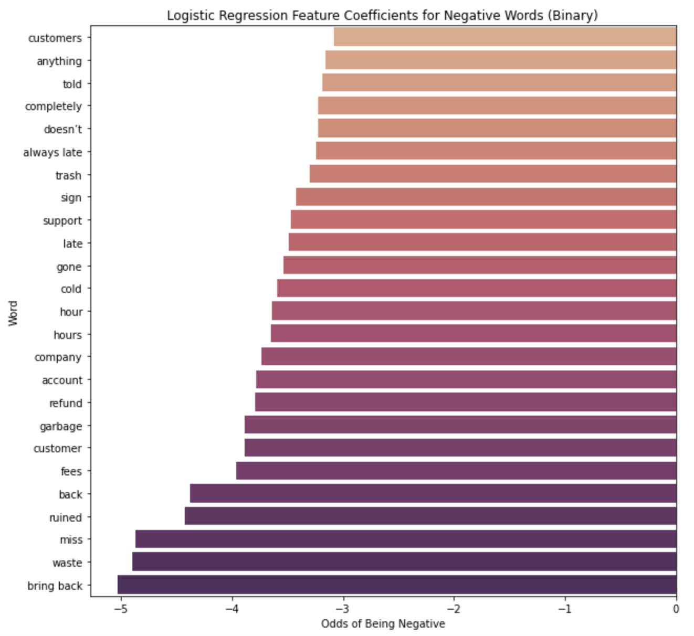

# NLP App Review Sentiment Analysis
**Author**: Jennifer Ha

## Overview
How the world eats is changing dramatically. A little under two decades ago, restaurant-quality meal delivery was still largely limited to foods such as pizza and Chinese. Nowadays, food delivery has become a global market worth more than $150 billion, having more than tripled since 2017. In the United States, the market has more than doubled during the COVID-19 pandemic, following healthy historical growth of 8 percent (Source: [McKinsey](https://www.mckinsey.com/industries/technology-media-and-telecommunications/our-insights/ordering-in-the-rapid-evolution-of-food-delivery)).

With this emerging trend, food delivery apps are also booming and offers a more convenient way for people to get the meals that they want. Therefore, hungry users are willing to pay additional charges and delivery fees to have it delivered to their front door. These types of apps aren’t going anywhere anytime soon. More than likely, they’re here to stay — for good. 
***

## Business Problem
The goal of this analysis is to determine what characteristics of Food Delivery apps currently available on the iOS App Store resonate well with the users and what can be improved. Through sentiment analysis of text reviews and their corresponding ratings, we will examine what words are more likely to indicate a positive vs a negative app review.
The analysis will help our potential client by providing insights into how to develop a strategy for building a new mental health app that can compete with apps that have already seen success.
***

## Data
Besides the major players based in the US, I also chose some other successful apps around the world that are still big enough to run their business in the US. I came up with a list of 10 food delivery apps and compiled the dataset for this analysis through [app review scraping](https://github.com/jennifernha/NLP-App-Reviews-Sentiment-Analysis/blob/main/Data-Collection.ipynb), which includes text reviews paired with rating out of 5 for 10 food delivery apps. 

The review texts will be our independent variables, and our target variable will be the rating out of 5.
***

## Methods
This project conducts analysis for 3 different types of classification: 1 multi-class classification and 2 binary classifications. 
 * Multi-class Classification: Negative (1-2), Neutral (3), Positive (4-5)
 * Binary Classification: Negative (1-3), Positive (4-5)
 * Binary Classification: Negative (1-2), Positive (3-5)

We first explore the data to have a better understanding of the app reviews that we compiled for 10 food delivery apps, then further implement techiniques such as tokenization, lemmatization and stopword removal to analyze word frequencies prior to modeling. 

During the modeling phase, we vectorize the review texts including individual words and bigrams as our features. Then, we run Logistic Regression and Random Forest models for multi-class sentiments,and add Support Vector Classification for binary sentiments. As the last step, we implement gridsearch for each classification type and run a final model with the best parameters to optimize model performance and address the issue of under or overfitting to the training data.
***

## Results
### <ins>Winning Model: Logistic Regression<ins>

The overall best performing model was the binary Logistic Regression model with a F1 score of 0.83. This model had a recall score of 0.89 in predicting negative sentiment and 0.74 in predicting positive sentiment.

### <ins>WordClouds<ins>




Our wordclouds show that most commonly mentioned words are very similar for both positive and negative sentiments. Such result indicates that users could be either satisfied or disappointed by order accuracy, delivery time, and customer service. There are some words related to fees and refund for the negative sentiment, which suggests service fees or delivery fees are directly tied to negative user experience. Moreover, while a refund could be the best way to make up for any issues, it still leaves a bad impression because customers easily think that a refund is a must when they are not satisfied with their experience.  

### <ins>Coefficient Analysis<ins>
 
 

Coefficient Analysis shows that users are more likely to have positive sentiments when the apps have great customer service, are easy and convenient to use, food is delivered on time and cooked well. For negative sentiment, on the other hand, there were many words related to delayed delivery, food gone cold due to this reason, customer service,refund, and fees. 
***
## Recommendation
1. **Focus on building an impressive UI/UX.** From the coefficient analysis for positive words, it was evident that users were happy when using an app that was easy to use. Nowadays  there is too much information to consume so people prefer convenience and simplicity. Therefore, it is imperative to build an app that is not too complicated to use. 

2. **Build a strong delivery operations system.** There were many words present in both coefficient analysis for positive and negative words, which means that 'delivery' is a feature that can easily influence a user's sentiment. In terms of operations, it is important that there are enough drivers ready and available to complete delivery without any delays. 

3. **Food quality matters.** Even though the users know that it will take longer for their food to arrive when ordering in than dining in, they still expect their food to be kept hot/cold and delicious. Therefore, I highly recommend working with restaurants on how to adjust their cooking method and packaging to serve with the best quality.

4. **No more additional charges please!** It is quite common to see additional charges being applied when ordering delivery these days. However, it was evident from our analysis that people are more likely to leave bad reviews when this happens. While additional cost is unavoidable, we should seek a way to minimize the cost more competitively.

5. **Easy access customer service.** When something goes wrong, it could be quite frustrating when it is difficult to reach the customer service. Not to mention that the quality of customer service is important, users should be able to reach the customer service without any difficulty. For example, there can be a button for customer service and giving an option to either call or email immediately about an food/delivery on the order summary page. 

6. **Users don't like refunds!** While it makes sense to provide a refund when an order wasn't delivered on time or accurately, refunds are what the customers want. When placing an order through an app, users expect the correct items to be delivered on time. They are excited and hungry while waiting for their food, and it should be understandable that it could be a very disappointing experience when it gets to a point where they must receive a refund. 

***
## Next Steps:
1. Our data is currently limited to the reviews and ratings on the Apple App Store. Collecting and analyzing app reviews from the Google Play Store to examine how they compare would help us get a well-rounded idea of the sentiments of all mobile app users, as opposed to just Apple users.
***

## For More Information
See the full analysis in the [Jupyter Notebook](https://github.com/jennifernha/NLP-App-Reviews-Sentiment-Analysis/blob/main/NLP-App-Sentiment-Analysis.ipynb) or review this [presentation](https://github.com/jennifernha/NLP-App-Reviews-Sentiment-Analysis/blob/main/Presentation.pdf). For additional info, contact Jennifer Ha at jnha1119@gmail.com.
***

## Repository Structure
```
├── data
├── images 
├── Data-Collection.ipynb  
├── NLP-App-Sentiment-Analysis.ipnyb                        
├── Presentation.pdf
├── README.md             
└── functions.py